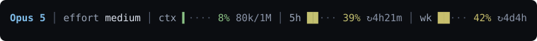
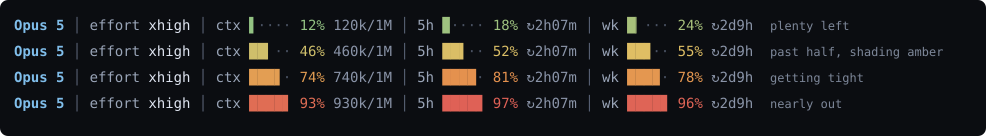

# claude-code-statusline-simple

A single-file status line for [Claude Code](https://claude.com/claude-code).
No dependencies, no config file, no Nerd Font. One Python script, ~300 lines.



It shows the model, the reasoning effort, the advisor model, how full the
context window is, and how much of each rate-limit window is used.

## The gauges change colour as they fill

Green while there is room, amber past halfway, red when a window is nearly
spent. The shift is continuous rather than stepped, so a limit creeping up on
you is visible before it becomes a number you have to read.



Both images are drawn by `statusline.py` itself (`python3 tools/render_svg.py`
turns its real ANSI output into SVG), so what is shown here is what the script
prints — not a mock-up.

## Why another one

There are richer status lines out there ([ccstatusline](https://github.com/sirmalloc/ccstatusline)
is excellent and configurable). This one is deliberately not that: no build
step, no npm, no TOML. Copy one file, add four lines to `settings.json`, done.

Two details it does get fussy about:

- **Sub-cell bars.** The bar is drawn at 1/8-cell precision, so 8% still shows
  a visible `▍` instead of collapsing to an empty bar.
- **Advisor model.** As of Claude Code 2.1.229 the advisor model is not in the
  status line JSON, so it is recovered by tailing the last assistant message in
  the transcript.

## Install

```sh
curl -o ~/.claude/statusline.py \
  https://raw.githubusercontent.com/chobitnet/claude-code-statusline-simple/main/statusline.py
```

Then in `~/.claude/settings.json`:

```json
{
  "statusLine": {
    "type": "command",
    "command": "python3 ~/.claude/statusline.py"
  }
}
```

Requires Python 3.8+ (stdlib only) and a terminal with truecolor support.

## Preview it before installing

```sh
python3 statusline.py --demo
```

This renders both styles against sample data and prints a glyph check, so you
can see whether the partial-block characters and the Powerline arrow survive
your font.

## Styles

`minimal` (default) separates segments with a thin rule and needs no special
font. `powerline` uses filled backgrounds joined by ``, which requires a
Nerd Font:

```sh
CC_STATUSLINE_STYLE=powerline python3 ~/.claude/statusline.py
```

Set it in the `settings.json` command if you want it permanently:

```json
"command": "CC_STATUSLINE_STYLE=powerline python3 ~/.claude/statusline.py"
```

## Debugging

Claude Code passes the status line a JSON object on stdin
([schema](https://code.claude.com/docs/en/statusline)). To capture what your
version actually sends:

```sh
touch ~/.claude/.statusline-debug
```

The next render writes the raw JSON to `~/.claude/.statusline-input.json`.
Delete the flag file to stop.

## Customising

Everything worth changing is a constant near the top of the file: the colour
stops (`HEAT_STOPS`), the bar width (`BAR_W`), the greys, and the accent
colours. `build()` decides which segments exist; `render_minimal()` and
`render_powerline()` decide how they look. The two are kept separate so a new
renderer only has to handle the segment dicts.

## Licence

MIT. See [LICENSE](LICENSE).

---

## 日本語

[Claude Code](https://claude.com/claude-code) のステータスラインを、Python 1ファイルだけで
済ませるものです。依存なし・設定ファイルなし・Nerd Font なし。約300行のスクリプト1本です。


表示するのは、モデル / effort / advisor モデル / コンテキストの使用量 /
レート制限の各枠の使用量です。

### ゲージは埋まるにつれて色が変わります

余裕があるうちは緑、半分を越えると琥珀、残り僅かになると赤。段階で飛ばずに**連続的に**
変わるので、制限がじりじり近づいていることが、数字を読む前に見えます。


この2枚は `statusline.py` 自身に描かせています(`python3 tools/render_svg.py` が実際の
ANSI 出力を SVG に写します)。ここに出ているのはスクリプトが吐く実物で、作り物ではありません。

### なぜもう1つ作ったのか

もっと多機能なステータスラインがあります([ccstatusline](https://github.com/sirmalloc/ccstatusline)
は優秀で、設定も効きます)。これは意図してそちら側に行きません。ビルド手順なし、npm なし、
TOML なし。1ファイルをコピーして `settings.json` に4行足せば終わりです。

そのうえで、2点だけこだわっています。

- **サブセル精度のバー**。バーを1/8セル刻みで描くので、8% でも空バーに潰れずに `▍` が残ります。
- **advisor モデル**。Claude Code 2.1.229 時点で advisor はステータスラインの JSON に含まれないため、
  トランスクリプトの最終 assistant メッセージを末尾から読んで復元しています。

### 導入

```sh
curl -o ~/.claude/statusline.py \
  https://raw.githubusercontent.com/chobitnet/claude-code-statusline-simple/main/statusline.py
```

`~/.claude/settings.json` に:

```json
{
  "statusLine": {
    "type": "command",
    "command": "python3 ~/.claude/statusline.py"
  }
}
```

Python 3.8 以降(標準ライブラリのみ)と、truecolor が出るターミナルが要ります。

### 入れる前に見る

```sh
python3 statusline.py --demo
```

2つのスタイルをサンプルデータで描き、グリフ確認も出します。部分ブロックの文字と Powerline の
矢印が、お使いのフォントで壊れないかがここで分かります。

### スタイル

既定の `minimal` は細い罫線で区切るだけなので、特別なフォントは要りません。`powerline` は
色付きの背景を `` で継ぐので、Nerd Font が必要です。

```sh
CC_STATUSLINE_STYLE=powerline python3 ~/.claude/statusline.py
```

常にそちらにするなら、`settings.json` の command に書きます。

```json
"command": "CC_STATUSLINE_STYLE=powerline python3 ~/.claude/statusline.py"
```

### デバッグ

Claude Code は [スキーマ](https://code.claude.com/docs/en/statusline)どおりの JSON を
stdin で渡してきます。お使いのバージョンが実際に何を送っているかを見るには、
次のようにします。

```sh
touch ~/.claude/.statusline-debug
```

次の描画で、生の JSON が `~/.claude/.statusline-input.json` に落ちます。止めるときは
フラグのファイルを消してください。

### 手を入れる

変える価値のあるものは全部ファイル冒頭の定数に置いてあります。色の停留点(`HEAT_STOPS`)、
バーの幅(`BAR_W`)、グレーの階調、アクセントの色の4つです。どの項目を出すかは `build()`、
どう見せるかは `render_minimal()` と `render_powerline()` が決めます。分けてあるので、
描き方を足すときはセグメントの dict だけ相手にすれば済みます。

### ライセンス

MIT ライセンスです。[LICENSE](LICENSE) を見てください。
